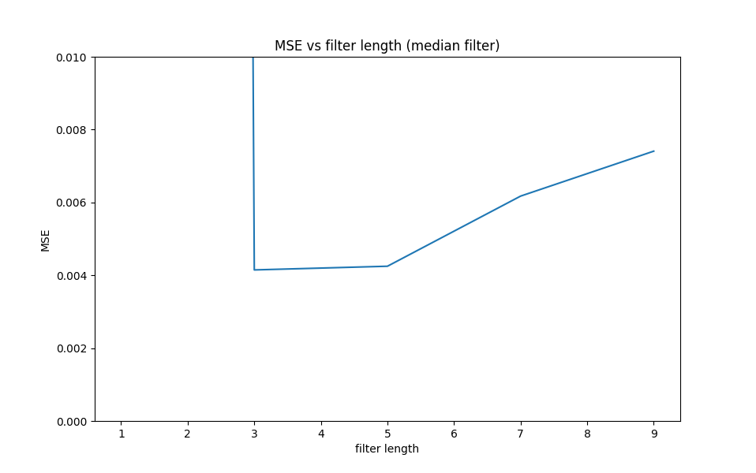

# Assignment II Audio Restoration using Python

## Main Task
This assignment builds on Assignment I. We assume that we have successfully detected the clicks and we are applying different interpolation methods to restore the audio, such as
- median filtering
- cubic splines

---

## Installation and Execution

The project is built with python 3.11.5 and the requirements are listed in the requirements.txt. Use the command below to install the requirments you need.

```sh                                 
pip install -r requirements.txt
```

Afer installing all required packages you can run the demo file simply by typing:
```sh
python prj/filter_test.py 
```
---

## Methodology and Results
Describe here how you have designed your code, e.g. a main script/routine that calls different functions, is the unittesting included in the main routine? 


**Results**

1. For the median filter, different lengths were explored to test the effectiveness of the restoration. In particular, XXXX were tested and XXX was observed to deliver the lowest MSE, as shown in the figure below.



The restored waveform <output_medianFilter.wav> with the optimal filter length is given below:


2. Using the cubic splines, we observe ....

The restored waveform <output_cubicSplines.wav> with the optimal filter length is given below:


3. Comparing the two different interpolation methods, we notice that method X achieves a lower MSE. The runtime of XX method is .....

After listening to the two restored files, we notice ...


---
## Credits

This code was developed for purely academic purposes by XXXX (add github profile name) as part of the module ..... 

Resources:
- XXXX
- XXX


