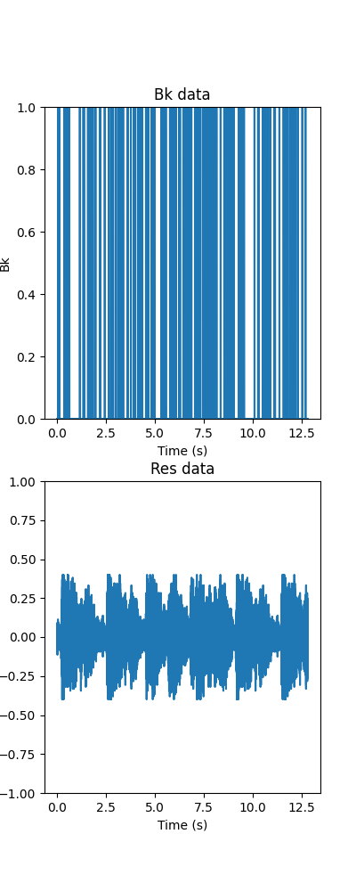

# Assignment II Audio Restoration using Python
Github link 
```sh   
https://github.com/CNStanLee/myeie/tree/b021bfd73ac1f2430937db4bef3c44a54ef2d99d/001CourseWare/005ComputationalMethod/homework/assi2
```
## Main Task
This assignment builds on Assignment I. We assume that we have successfully detected the clicks and we are applying different interpolation methods to restore the audio, such as
- median filtering
- cubic splines

---

## Installation and Execution

The project is built with python 3.11.5 and the requirements are listed in the requirements.txt. Use the command below to install the requirments you need.

```sh                                 
pip install -r requirements.txt
```

Afer installing all required packages you can run the demo file simply by typing:
```sh
python prj/demo.py 
```
---

## Methodology and Results
By dividing the function blocks to different scripts as data processing funciton block script, median filter funciton block and spline filter function block. The demo script is the main script that will finally call the sub function and finish the demostration.  
The median filter and spline filter funtion script contain unit test function inside. You can mannually run the unit test by run these two scrupt individually.

```sh
python prj/median_fil.py 

python prj/spline_fil.py 
```

**Results**

1. For the median filter, different lengths were explored to test the effectiveness of the restoration. In particular, odd number from 1 - 9 filter length were tested and length = 3 was observed to deliver the lowest MSE = 0.00414, as shown in the figure below.


The restored waveform <output_medianFilter.wav> with the optimal filter length = 3 is given below:


For the comparation, the related signal waveform are listed below:




2. Using the cubic splines, different lengths were explored to test the effectiveness of the restoration. In particular, odd number from 1 - 29 filter length were tested and length = 21 was observed to deliver the lowest MSE = 0.00113, as shown in the figure below.


The restored waveform <output_cubicSplines.wav> with the optimal filter length = 21 is given below:


3. Comparing the two different interpolation methods, we notice that method Splines achieves a lower MSE.  
The runtime of median(3) is 0.071 and time of spline(21) is 0.105

After listening to the two restored files, we notice that the filter has fix the audio, the filter actually works.

---
## Conclusions

|  Method       | Median  | Spline  |
|  ----         | ----    | ----    |
| MSE           | 0.00414 | 0.00113 |
| Best Length   | 3       |  21     |
| Run time      | 0.071   | 0.105   |

---
## Credits

This code was developed for purely academic purposes by CNStanLee as part of the module Computational Method. 
Changhong Li


